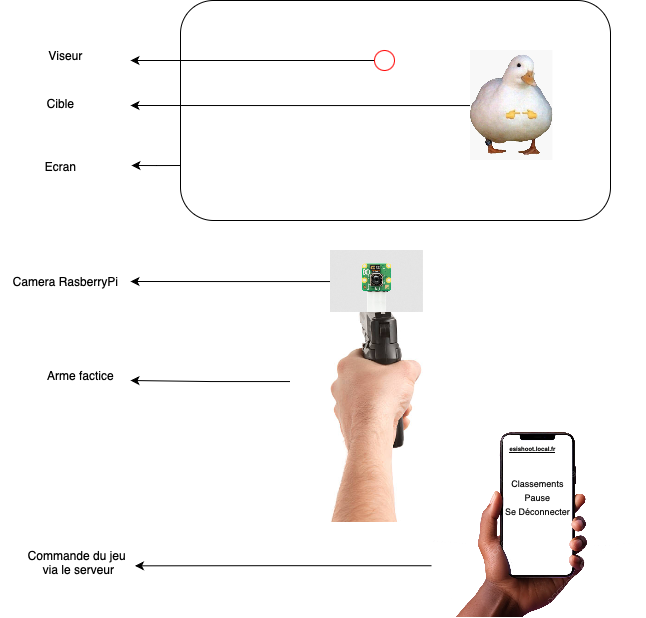
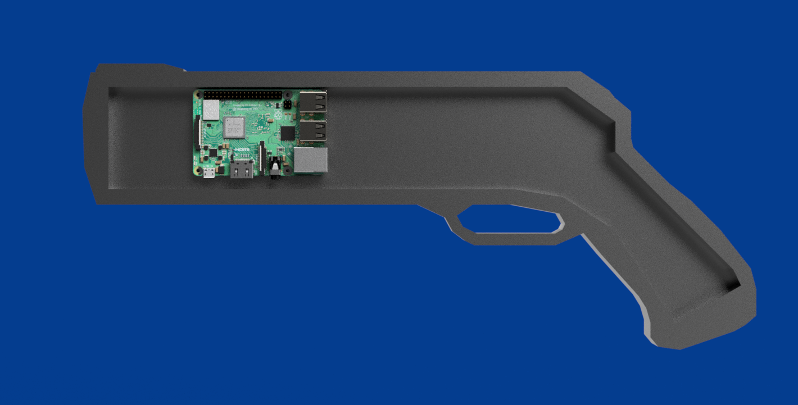
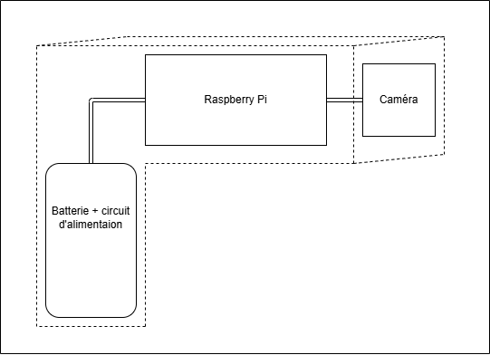
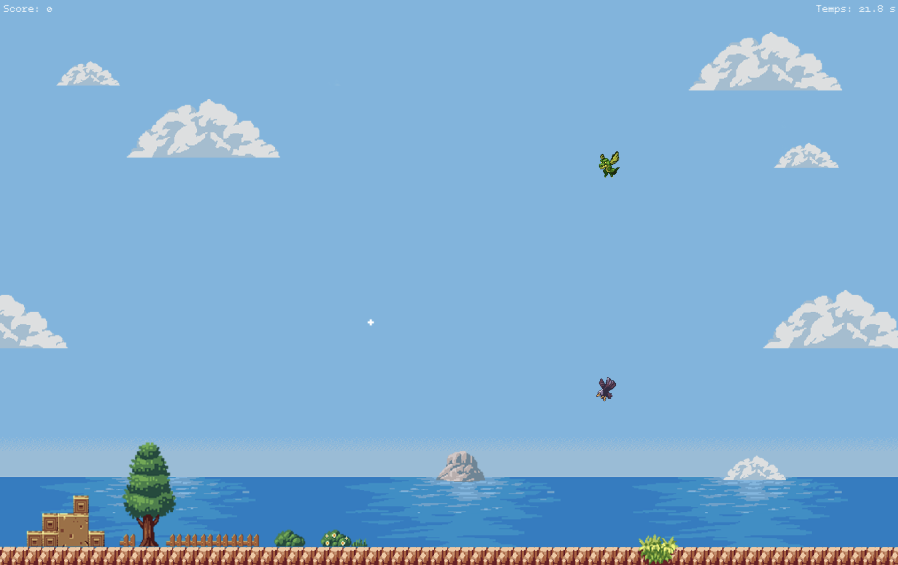
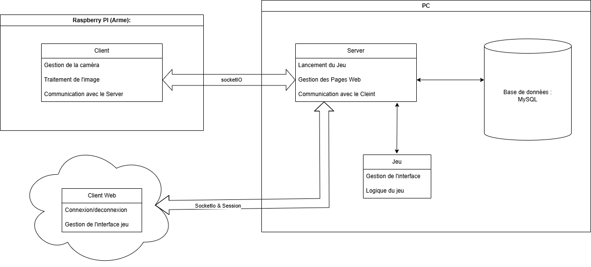
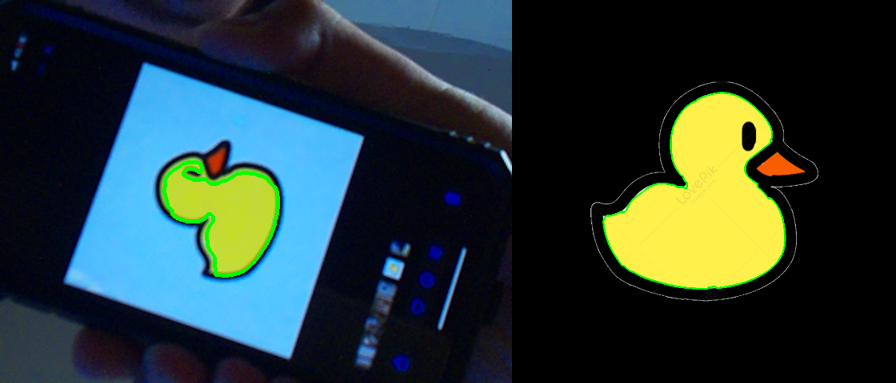
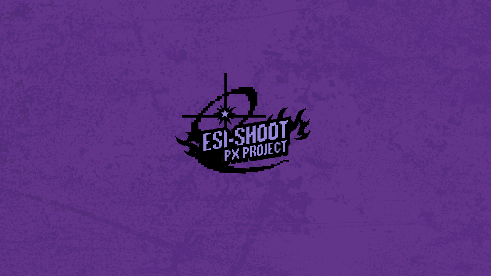

# ESI-SHOOT: Connected Shooting Range

> Multidisciplinary project : PX457 - ESISAR Grenoble INP
> Authors: Sita, Ismail, Mahmoud, Dario

## Photos

## Main idea

We’ve got a screen showing the game, a projector, a Raspberry Pi with our gun, and a phone to connect to the server, all like a remote control. We can start the game, pause it, and even check out the top players!


## Cross-section diagram Gun conception

## 3D Gun conception

The gun is made from cardboard.


## Little insight into the game


## Principle of the project (French)


## Testing the openCV code with an image of a duck




---
## Presentation

ESI-SHOOT is a connected shooting range combining **interactive gameplay**, **real-time image processing**, and a **client-server architecture**. The goal: aim at animated targets displayed on screen using a connected pistol equipped with a camera, and determine whether a shot is successful through image analysis.


---

## Project Architecture

### 1. Game (Pygame)
- Display of targets (aigle, gator, pato, grenouille)
- Two modes: Chill Mode (easy) and Reflex Mode (faster)
- Score management, animations, crosshair and time

Main file: `jeu.py`

### 2. Interface (Menu)
- Navigation menu with options: Play, Settings, Credits, Leaderboard
- Launching game modes
- Graphic and sound integration

Main file: `menu.py`

### 3. Client (Raspberry Pi)
- Manages a physical button and the camera
- Image analysis with OpenCV via `matching.py`
- Sends results (`hit` or `miss`) to the server via TCP

Main file: `client.py`

### 4. Image Processing
- Target detection from a reference image
- Color masking + shape comparison using `cv2.matchShapes`
- Also checks centering of the target in the image

File: `matching.py`

### 5. Web & Game Server
- Flask server with SocketIO
- Display of the game (Pygame)
- User, score and session management
- Communication with the Raspberry client via TCP

Main file: `server.py`

---

## File Organization

```
game/
 ├── assets/         # Graphic and sound resources
 ├── jeu.py          # Pygame game engine
 ├── monstre.py      # Animated monster class
 ├── menu.py         # Main menu
 └── ...
database/
 ├── models/         # User models (User)
 ├── db_config.py    # MySQL DB connection
 └── init_db.py      # Initialization
server.py          # Flask + Pygame server
client.py          # Raspberry Pi client (camera + button)
matching.py        # Image analysis via OpenCV
```

---

## Project Launch

### Prerequisites
- Python 3.8+
- MySQL Server
- Raspberry Pi with camera and physical button
- Python libraries: `pygame`, `opencv-python`, `flask`, `flask-socketio`, `RPi.GPIO`, etc.

### Launch the game
```bash
python -m game.server
```

### On the Raspberry Pi side
```bash
python client.py
```

---

## Key Features

- Real-time image analysis
- Mouse-controlled crosshair
- Client-server communication (TCP + WebSocket)
- Player ranking system
- Authentication and avatars
- Contour detection + target centering

---

## Limitations and Possible Improvements

- Spectators not yet implemented
- No automated calibration system
- Recognition AI not integrated (too complex for the need)
